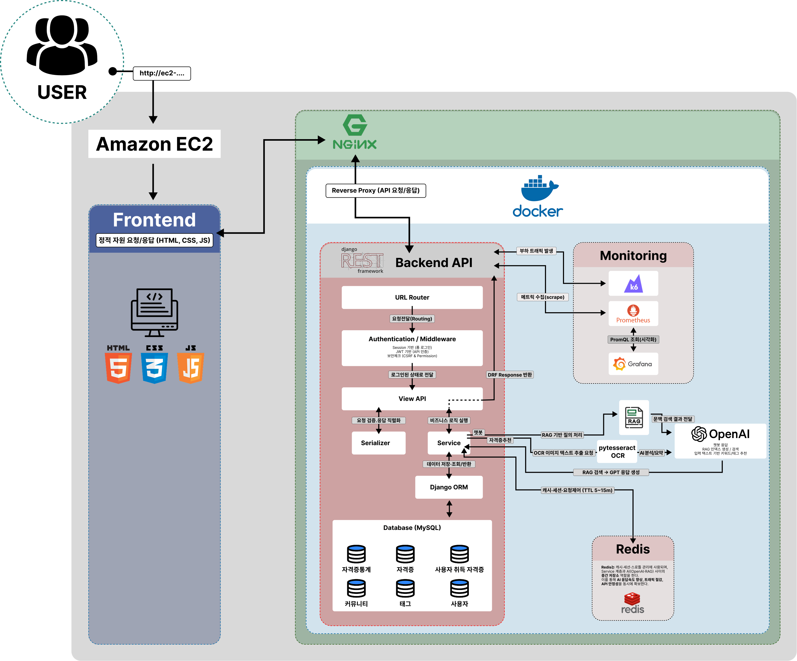

# SkillBridge

AI 기반 자격증 추천 & 커리어 커뮤니티 플랫폼

> OpenAI와 Django 기반의 통합 플랫폼으로, 자격증 데이터 통계·맞춤형 추천·커뮤니티 기능을 제공하는 **지능형 자격정보 서비스**이며, AI 추론과 사용자 상호작용을 결합하여 개인화된 학습 및 진로 인사이트를 제공합니다.

## 목차
- [프로젝트 소개](#-프로젝트-소개)
- [핵심 가치 제안](#-핵심-가치-제안)
- [주요 기능](#-주요-기능)
- [아키텍처 한눈에 보기](#-아키텍처-한눈에-보기)
- [기술 스택](#-기술-스택)
- [프로젝트 구조](#-프로젝트-구조)
- [로컬 개발 환경 설정](#-로컬-개발-환경-설정)
- [데이터 & RAG 파이프라인](#-데이터--rag-파이프라인)
- [실행 & 운영](#-실행--운영)
- [성능 검증](#-성능-검증)
- [테스트 & 품질](#-테스트--품질)
- [인증 & 접근 제어](#-인증--접근-제어)
- [협업 가이드](#-협업-가이드)
- [포트폴리오 하이라이트](#-포트폴리오-하이라이트)
- [추가 문서](#-추가-문서)

## 🚀 프로젝트 소개
최근 자격증 취득에 대한 사회적 수요가 급격히 증가하고 있지만, 국내 자격증 정보 제공 플랫폼은 **검색 효율이 낮고 정보 구조가 단편적**이라는 한계가 있습니다.  

**SkillBridge**는 이러한 문제를 해결하기 위해 개발된 **AI 기반 자격증 정보 추천 및 질의응답 서비스**입니다.  
사용자가 텍스트나 이미지를 입력하면, AI가 핵심 키워드를 분석하여 적합한 자격증을 추천하고 관련 정보를 신속하고 정확하게 제공합니다.  

본 프로젝트는 단순한 정보 제공을 넘어, 사용자가 **필요한 자격증을 탐색하고 학습 계획을 세울 수 있는 통합형 솔루션**을 지향합니다.

## 🎯 핵심 가치 제안
- 채용 공고·이력서·자기소개서 등의 텍스트 또는 이미지를 입력하면 AI가 직무 분석, 필요한 역량, 핵심 키워드를 한 번에 정리합니다.
- 자격증 DB, 통계, 사용자 후기 데이터를 복합적으로 매칭해 체감 난이도 기반 추천을 제공합니다.
- 구직자 커뮤니티와 관리자 심사 플로우를 통합해 데이터 품질과 사용자 참여를 동시에 끌어올립니다.
- 쿠버네티스, Docker, k6 등 운영·DevOps 구성까지 포함해 실무 배포 시나리오를 그대로 재현합니다.

## 🧩 주요 기능

### AI 상담 & RAG 기반 답변
- LangChain + OpenAI 기반의 한국어 최적화 프롬프트로 직무 분석, 태그 추천, FAQ 상담을 제공합니다.
- `data/rag/index.json`에 구축된 임베딩 인덱스를 통해 자격증 설명, 통계를 상황에 맞춰 검색합니다.
- 오류나 데이터 부족 상황에서는 안전한 폴백 답변과 관리자 알림 요약을 함께 반환합니다.

### 채용 공고 추천 엔진 & OCR
- 텍스트 또는 이미지(PDF 캡처 포함)를 업로드하면 Tesseract OCR로 업무 키워드를 추출하고, 추천 자격증을 제안합니다.
- 직무와 연관된 자격증을 점수화(`score`)하고, 매칭 이유·추가 준비 키워드를 함께 제공합니다.
- 사용자 피드백으로 태그-자격증 관계를 강화할 수 있는 제안(Contribution) 기능을 지원합니다.

### 자격증 데이터 허브
- 자격증 기본 정보, 연차별 합격 통계, 단계별 시험 구조를 모두 API로 제공합니다.
- 고급 검색 페이지에서 난이도, 태그, 합격률, 응시자 수 등 복합 필터링이 가능합니다.
- 사용자 취득 자격증 업로드 → 관리자 심사 → 공개 프로필 반영까지의 워크플로우를 지원합니다.

### 커뮤니티 & 평판 시스템
- 자격증 후기 게시판, 댓글, 좋아요, 평점(1~10점)을 제공해 사용자 생성 콘텐츠를 축적합니다.
- `hall_of_fame` 리더보드를 통해 합격자·기여자 데이터를 시각적으로 노출합니다.

### 운영자 포털
- 관리자 전용 페이지에서 자격증 업로드(엑셀), 취득 인증 심사, 지원 문의 티켓을 처리할 수 있습니다.
- 지원 문의는 intent 기반으로 자동 분류되어 운영자가 빠르게 대응할 수 있습니다.

## 🏗️ 아키텍처 한눈에 보기
- `Django 5 + Django REST Framework`로 단일 백엔드에서 API와 서버 렌더링 화면을 모두 제공합니다.
- `MySQL`을 메인 데이터베이스로 사용하고, 선택적으로 `Redis` 캐시를 붙여 AI 응답과 추천 결과를 단축합니다.
- `LangChain`으로 OpenAI ChatCompletion/Embedding API를 래핑하고, 캐시·폴백 로직을 커스터마이징했습니다.
- `Docker`, `docker-compose`, `k8s/` 매니페스트로 로컬-스테이징-프로덕션 단계별 배포 전략을 갖추었습니다.




## 🛠️ 기술 스택
| 영역 | 사용 기술 |
| --- | --- |
| Backend | Python 3.12, Django 5.2, Django REST Framework, Simple JWT |
| AI & Data | LangChain, OpenAI API, RAG(JSONL + 임베딩), Tesseract OCR, BeautifulSoup |
| Database | MySQL 8, django-redis, LocMem cache (fallback) |
| Frontend | Django Template, Vanilla JS, Tailwind 유사 유틸 클래스 |
| DevOps | Docker, docker-compose, Kubernetes(Deployment/Service), k6, GitHub Flow |
| 기타 | python-decouple, openpyxl, requests, Pillow, k6, Redis |

## 📂 프로젝트 구조
```text
team_1_project_final/
├─ SkillBridge/              # 프로젝트 설정, 공용 뷰, URL, 예외 처리
├─ ai/                       # AI 상담 API, LangChain 서비스, OCR, RAG 래퍼
├─ certificates/             # 자격증/통계 도메인 로직과 Excel 업로드 API
├─ community/                # 커뮤니티 게시판, 댓글, 좋아요
├─ ratings/                  # 자격증 리뷰/평점 및 요약 통계
├─ users/                    # 커스텀 User 모델, 인증/마이페이지/관리자 뷰
├─ templates/, static/       # SSR 템플릿과 정적 에셋
├─ scripts/                  # RAG 문서/임베딩 생성 유틸리티
├─ docker/, k8s/, k6/        # 배포 스크립트, 쿠버네티스 매니페스트, 부하 테스트
└─ data/                     # 원천 엑셀 & 생성된 RAG 산출물
```

## ⚙️ 로컬 개발 환경 설정

1. **필수 요구 사항**
   - Python 3.12 이상, MySQL 8, (선택) Redis, OpenAI API 키
   - macOS/Ubuntu에서 `mysqlclient` 빌드를 위해 `libmysqlclient`, `build-essential` 패키지가 필요합니다.

2. **레포지토리 클론**
   ```bash
   git clone https://github.com/RegularStar/team_1_project_final.git
   cd team_1_project_final
   ```

3. **가상환경 & 패키지 설치**
   ```bash
   python -m venv venv
   source venv/bin/activate  # Windows는 venv\Scripts\activate
   pip install --upgrade pip
   pip install -r requirements.txt
   ```

4. **환경 변수 설정** (`.env` 예시)
   ```env
   SECRET_KEY=your-secret-key
   DEBUG=True
   TZ=Asia/Seoul

   DB_HOST=127.0.0.1
   DB_PORT=3306
   DB_NAME=skillbridge
   DB_USER=skillbridge
   DB_PASSWORD=skillbridge

   GPT_KEY=sk-xxxxxxxx
   RAG_INDEX_PATH=data/rag/index.json
   AI_CHAT_CACHE_TTL=300
   AI_JOB_ANALYSIS_CACHE_TTL=900
   REDIS_URL=redis://127.0.0.1:6379/0  # 없으면 비워두면 LocMem 사용
   ```

5. **데이터베이스 준비**
   ```bash
   # MySQL에서 DB/계정 생성 (한 번만)
   mysql -u root -p -e "CREATE DATABASE skillbridge CHARACTER SET utf8mb4;"
   mysql -u root -p -e "CREATE USER 'skillbridge'@'%' IDENTIFIED BY 'skillbridge';"
   mysql -u root -p -e "GRANT ALL PRIVILEGES ON skillbridge.* TO 'skillbridge'@'%'; FLUSH PRIVILEGES;"
   ```

6. **마이그레이션 & 기본 계정 생성**
   ```bash
   python manage.py migrate
   python manage.py createsuperuser
   ```

7. **개발 서버 실행**
   ```bash
   python manage.py runserver
   ```
   브라우저에서 `http://127.0.0.1:8000`으로 접속합니다.

> Tip: 로컬 MySQL을 Docker로 띄우고 싶다면 `docker-compose up db`로 손쉽게 실행할 수 있습니다.

## 📊 데이터 & RAG 파이프라인

1. **원천 데이터 확인**  
   `data/data.xlsx`에는 자격증 기본 정보, 단계, 통계가 워크시트별로 정리되어 있습니다.

2. **RAG 문서 생성**
   ```bash
   python scripts/build_rag_documents.py \
     --input data/data.xlsx \
     --output data/rag/documents.jsonl
   ```

3. **임베딩 인덱스 빌드**
   ```bash
   export OPENAI_API_KEY=sk-...
   python scripts/build_rag_index.py \
     --input data/rag/documents.jsonl \
     --output data/rag/index.json \
     --model text-embedding-3-small
   ```
   `GPT_KEY` 또는 `OPENAI_API_KEY`가 없으면 AI 상담/추천 기능이 폴백 모드로 동작합니다.

4. **운영 플로우**
   - 엑셀을 수정한 뒤 위 스크립트를 순서대로 다시 실행하면 최신 데이터가 서비스에 반영됩니다.
   - `RAG_INDEX_PATH` 환경 변수를 변경하면 외부 스토리지나 벡터 DB와도 쉽게 연동할 수 있습니다.

## 🏃 실행 & 운영

### Docker Compose
```bash
docker compose up -d --build
docker compose logs -f web
```
- 서버(호스트) nginx가 80 포트에서 HTTP를 종료하고 Docker의 `web`(Django) 컨테이너로 프록시하도록 구성합니다. Compose 스택에는 별도 nginx 컨테이너가 없습니다.
- `web` 컨테이너는 `http://localhost:8080`으로 직접 접근할 수 있어 디버깅에 활용할 수 있습니다.
- `docker/entrypoint.sh`에서 마이그레이션과 정적 파일 수집을 자동화했습니다.
- `.env` 파일을 `docker-compose.yml`에서 재사용하여 환경을 일관되게 유지합니다.

### Kubernetes 빠른 배포
1. 로컬 k8s(Minikube/Kind) 클러스터를 구동합니다.  
   Minikube 사용 시 `eval $(minikube docker-env)`로 Docker 데몬을 연결합니다.
2. 이미지 빌드 & 적재
   ```bash
   docker build -t skillbridge:local .
   minikube image load skillbridge:local  # Minikube 한정
   ```
3. 환경 변수 시크릿 구성
   ```bash
   kubectl create secret generic skillbridge-env \
     --from-env-file=.env \
     --dry-run=client -o yaml | kubectl apply -f -
   ```
4. 리소스 배포 및 확인
   ```bash
   kubectl apply -f k8s/service.yaml
   kubectl apply -f k8s/deployment.yaml
   kubectl get pods,svc
   kubectl port-forward svc/skillbridge 8000:8000
   ```
   `curl http://localhost:8000/healthz`로 헬스체크를 검증합니다.

## 📈 성능 검증
`k6/` 디렉터리에는 실제 트래픽 패턴을 시뮬레이션하기 위한 스크립트가 포함되어 있습니다.

```bash
# k6 설치 후 실행 (기본 BASE_URL은 8000)
k6 run k6/script.js --env BASE_URL=http://localhost:8000
```
- `http_req_duration`, `home_duration` 등의 커스텀 메트릭으로 응답 시간을 추적합니다.
- 오류율이 5% 이상이면 장애로 간주하고, 캐시·DB·AI 호출 로그를 점검합니다.

## 🧪 테스트 & 품질
- 단위/통합 테스트: `python manage.py test`
- 주요 뷰와 서비스 레이어에 대해 기능 검증 테스트가 포함돼 있으며, 추가 시나리오는 `SkillBridge/tests/`와 각 앱의 `tests.py`를 확장하면 됩니다.
- AI 서비스는 외부 API 의존도가 높으므로, 환경 변수로 토글할 수 있는 모킹/폴백 경로를 제공해 안정성을 확보했습니다.

## 🔐 인증 & 접근 제어
- `djangorestframework-simplejwt` 기반 JWT 인증과 Django 세션 인증을 혼합 지원합니다.
- 사용자 권한은 `IsAuthenticated`, staff/superuser 체크, 객체 수준 검증으로 세분화했습니다.
- 관리자 페이지와 전용 뷰(`manage/`)에서 자격증 심사, 문의 응대, 데이터 업로드를 처리합니다.

## 🤝 협업 가이드
- 브랜치 전략: `main`은 배포용, 기능 개발은 `feature/{name}` 브랜치를 사용합니다.
- 커밋 메시지 컨벤션: `feat`, `fix`, `chore`, `docs` 등 Prefix + 간결한 설명.
- 작업 전 `git pull origin main`으로 충돌을 최소화하고, PR을 통해 코드 리뷰를 거친 뒤 병합합니다.
- 문서, 스크립트, 환경 설정 변경 시 PR 설명에 스크린샷 또는 로그를 첨부해 변경 의도를 명확히 합니다.

## 🌟 포트폴리오 하이라이트
- **AI 파이프라인 직접 설계**: 엑셀 → JSONL → 임베딩 → RAG 검색까지 자동화해 비전공자도 데이터 업데이트를 쉽게 수행할 수 있습니다.
- **실사용 시나리오 중심 설계**: 자격증 검색, 리뷰, 추천, 관리자 심사 등 실제 서비스 운영 흐름을 엔드 투 엔드로 구현했습니다.
- **안정성 확보**: 캐시, 폴백 응답, 에러 로깅을 도입해 OpenAI 장애나 외부 요인에도 서비스가 지속되도록 만들었습니다.
- **배포 자동화 경험**: Docker/K8s 구성을 직접 작성하고, k6로 부하 테스트를 돌려 성능 튜닝 근거를 제시할 수 있습니다.

## 📚 추가 문서
- `API.md` — REST API 상세 문서
- `docker/entrypoint.sh` — 컨테이너 부팅 스크립트
- `k8s/` — Kubernetes 배포 매니페스트
- `k6/` — 부하 테스트 시나리오
- `scripts/` — 데이터 전처리 & 임베딩 생성 스크립트

---
궁금한 점이나 개선 아이디어가 있다면 Issue/PR로 남겨주세요. SkillBridge를 통해 구직자와 운영자 모두가 더 빠르게 연결될 수 있습니다!
